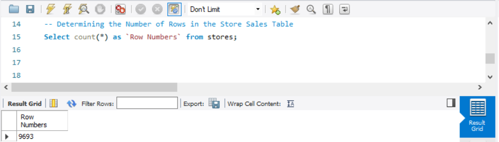
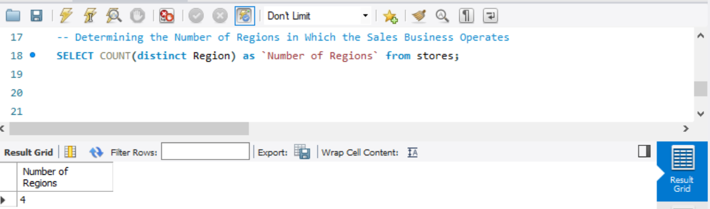
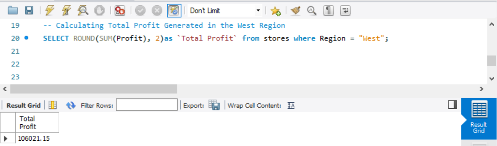
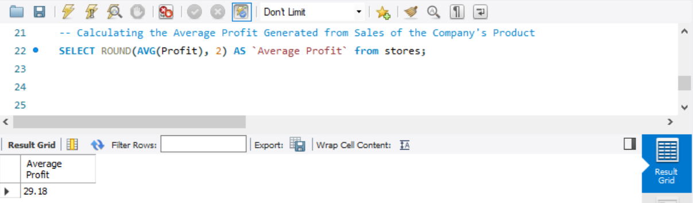
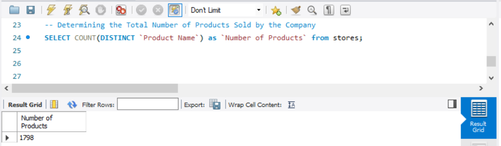

# SALES ANALYSIS

## INTRODUCTION

The Comprehensive Sales Analysis is a detailed examination of a company's sales-related data, encompassing 9693 rows of information, aimed at gaining a holistic understanding of various key aspects. This analytical endeavor involves investigating the SALES table to extract valuable insights related to the company's performance in different regions, profitability, product sales, order fulfillment efficiency, and customer contributions. Each task within this analysis is carefully designed to unveil specific aspects of the sales landscape, providing a comprehensive overview that aids in strategic decision-making and performance improvement. From determining the number of rows in the SALES table to identifying top-contributing customers and analyzing sales patterns in specific cities, this analysis delves into critical metrics that drive business success. 

## PROBLEM STATEMENT
1. Determine the total number of rows present in the SALES table
2. Identify the regions in which the business operates
3. Calculate the total profit specifically generated in the WEST Region
4. Compute the average profit generated from the sales of the company's products
5. Count the total number of unique products sold by the company
6. Identify and showcase the names and cities of the top 5 customers who contribute the most to the company's overall profit
7. Display the sales figures for cities where the total sales is greater than the 20000

## SKILLS AND CONCEPTS DEMOSTRATED

The Comprehensive Sales Analysis task involves a range of skills and concepts in data analysis, database management, and business intelligence. Here are the key skills and concepts demonstrated in each problem statement:

- Basic SQL query writing, data manipulation and Understanding data structure
- SQL aggregation functions, region-specific filtering
- SQL ranking functions, customer profiling
- SQL conditional filtering

Overall, this task encompasses a variety of data manipulation and analysis skills, combined with a solid understanding of business concepts such as profitability, market segmentation, and customer contribution. It showcases the ability to extract actionable insights from a dataset to inform strategic decision-making.

## ANALYSIS, DISCUSSIONS AND RESULTS

### 1. Determine the total number of rows present in the SALES table:

To ascertain the overall count of rows within the sales table, the SELECT function, combined with the COUNT aggregation, will be utilized. The syntax for this operation is presented below:

```sql
SELECT COUNT(*) AS Row_Numbers FROM Sales;
```

In the provided syntax, the asterisk (*) denotes all rows, and the AS keyword signifies the creation of an alias. Consequently, the output of the analysis will feature "Row_Numbers" as the column header instead of "COUNT()".




### 2. Identify the regions in which the business operates:

To pinpoint the regions in which the business operates, we will utilize the SELECT function along with the COUNT aggregation, DISTINCT function, and the aliasing feature. The syntax for this task is outlined below:

```sql
SELECT COUNT(DISTINCT Region) AS Number_of_Regions FROM Stores;
```

In the provided syntax, the DISTINCT keyword applied to the "Region" column ensures that the command counts the number of unique regions rather than tallying the occurrences of each region. The AS keyword serves to rename the output column as "Number_of_Regions," replacing the default "COUNT(DISTINCT Region)." The expected result of this analysis is a count of 4 unique regions.




### 3.  Calculate the total profit specifically generated in the WEST Region:

To compute the total profit specifically generated in the West region, we will utilize the SELECT function, the SUM aggregation, the AS (aliasing feature), and the WHERE CLAUSE function. The syntax for this operation is presented below:

```sql
SELECT ROUND(SUM(Profit), 2) AS `Total Profit` FROM Stores
WHERE Region = "West";
```

In the provided syntax, the ROUND function is applied to limit the result to two decimal places, enhancing readability. The WHERE CLAUSE ensures that only data from the West region is considered in the calculation. The output of this analysis reveals a total profit of $106,021.15 generated in the West region.



### 4. Compute the average profit generated from the sales of the company's products:

To determine the average profit generated from the sales of the company's products, the SELECT function, AVG aggregation (commonly denoted as AVG), and the AS function for aliasing are utilized. The syntax for this calculation is outlined below:

```sql
SELECT ROUND(AVG(Profit), 2) AS `Average Profit` FROM Stores;
```

In this syntax, the AVG aggregation function calculates the average profit, and the ROUND function is applied to round the result to two decimal places for clarity. The AS keyword is used to create an alias, renaming the output column as "Average Profit" instead of the default "AVG(Profit)." The expected result of this analysis is an average profit of $29.18 generated from the sales of the company's products.



### 5. Count the total number of unique products sold by the company:

To determine the count of unique products sold by the company, the SELECT function, COUNT aggregation, DISTINCT function, and the AS feature for aliasing are utilized. The syntax for this operation is presented below:

```sql
SELECT ROUND(COUNT(DISTINCT `Product Name`)) AS Number_of_Products FROM Stores;
```
In this syntax, the DISTINCT function ensures that only unique product names are considered in the count. The AS keyword is used to create an alias, naming the output column as "Number_of_Products" instead of the default "COUNT(DISTINCT Product Name). The ROUND function is applied to round the result to the nearest whole number. The expected result of this analysis is a count of 1798, representing the total number of unique products sold by the company.




 


